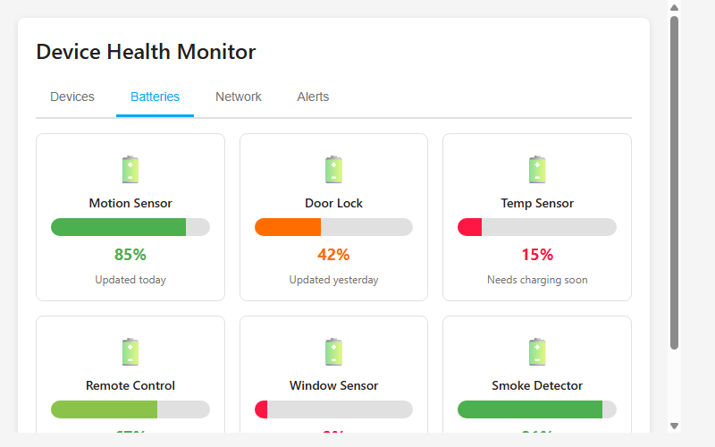
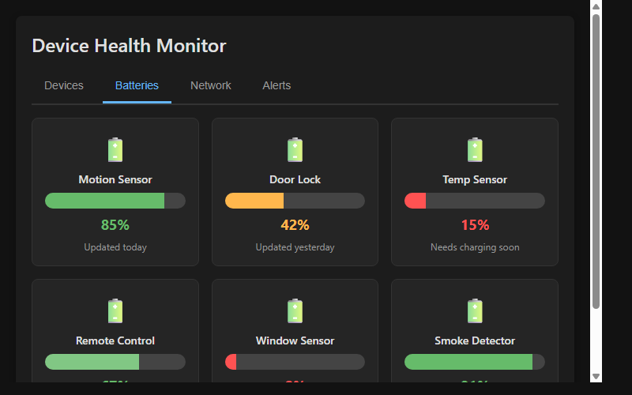

# Device Health Monitor Card for Home Assistant

A comprehensive Home Assistant custom card for monitoring device health, battery levels, network connectivity, and system alerts. Keep track of all your devices in one place.

## Features

- **Devices Tab**: Monitor device status, uptime, and last seen information with search and filtering
- **Batteries Tab**: Grid view of battery-powered devices with color-coded health indicators
- **Network Tab**: Signal strength monitoring across WiFi, Zigbee, and Z-Wave protocols
- **Alerts Tab**: Active alerts with history tracking and dismissal capabilities

## Installation

### Via HACS (Home Assistant Community Store)

1. Open HACS in Home Assistant
2. Click "Explore & Download Repositories"
3. Search for "Device Health Monitor"
4. Click "Download"
5. Restart Home Assistant

### Manual Installation

1. Create a directory `custom_components/device_health/` in your Home Assistant config
2. Copy `ha-device-health.js` into this directory
3. Add to your dashboard:

```yaml
type: custom:ha-device-health
title: Device Health
battery_warning: 30
battery_critical: 10
offline_alert_minutes: 60
```

## Configuration

| Option | Type | Default | Description |
|--------|------|---------|-------------|
| `type` | string | Required | `custom:ha-device-health` |
| `title` | string | "Device Health" | Card title |
| `battery_warning` | number | 30 | Battery level threshold for warnings (%) |
| `battery_critical` | number | 10 | Battery level threshold for critical alerts (%) |
| `offline_alert_minutes` | number | 60 | Minutes before marking device offline as alert |

## Screenshots

Light theme:


Dark theme:


## Requirements

- Home Assistant 2021.8 or later
- Device tracking entities and battery sensors
- Browser with Shadow DOM support

## License

MIT License - Feel free to use and modify
