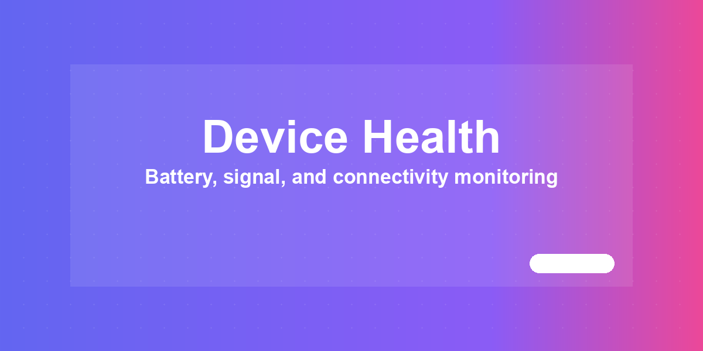

# HA Device Health



Monitor the health of your Home Assistant devices from one Lovelace card:
battery levels, availability and alerts. Zero configuration — add the card and it
scans your entities automatically.

[](https://github.com/MacSiem/ha-device-health/releases) [](LICENSE)

## How it works

**Short version: it works automatically.** The card reads your existing entities —
no extra integration, no YAML:

1. **Batteries.** An entity counts as a battery *level* only when it has
   `device_class: battery` or a `%` unit **and** a numeric 0–100 state. Helper
   entities from Battery+/Battery Notes (like `*_battery_type` or
   `*_battery_quantity`) are excluded, so counts and labels never pollute the list
   (fixed in v4.2.3).
2. **Availability.** Devices with `unavailable`/`unknown` entities are surfaced so
   you spot dead sensors and dropped integrations quickly.
3. **Alerts.** Threshold-based alerts (e.g. low battery) with a history view.

### What is automatic vs. manual

| Automatic | Manual (optional) |
|---|---|
| Discovering batteries and devices | Adjusting alert thresholds |
| Filtering out Battery+ helper entities | Dismissing/reviewing alerts |
| Availability monitoring | — |

## Installation

1. Open HACS → Custom repositories.
2. Add `https://github.com/MacSiem/ha-device-health` as category **Dashboard**
   (Lovelace plugin).
3. Install **HA Device Health** and reload your browser.

## Quick start

```yaml
type: custom:ha-device-health
```

That's it — no options are required.

## FAQ

**Do I have to configure anything?**
No. The card discovers batteries and devices from your existing entities.

**Why doesn't my battery show up?**
It needs `device_class: battery` or a `%` unit and a numeric 0–100 state. Text
states ("low"/"ok") and count entities are intentionally excluded.

**Does this send data anywhere?**
No. Everything runs locally in your browser against your Home Assistant instance —
no telemetry, no CDN assets.

## Changelog

See [CHANGELOG.md](CHANGELOG.md).

## Support

- [Buy Me a Coffee](https://buymeacoffee.com/macsiem)
- [PayPal](https://www.paypal.com/donate/?hosted_button_id=Y967H4PLRBN8W)

## License

MIT, see [LICENSE](LICENSE).
