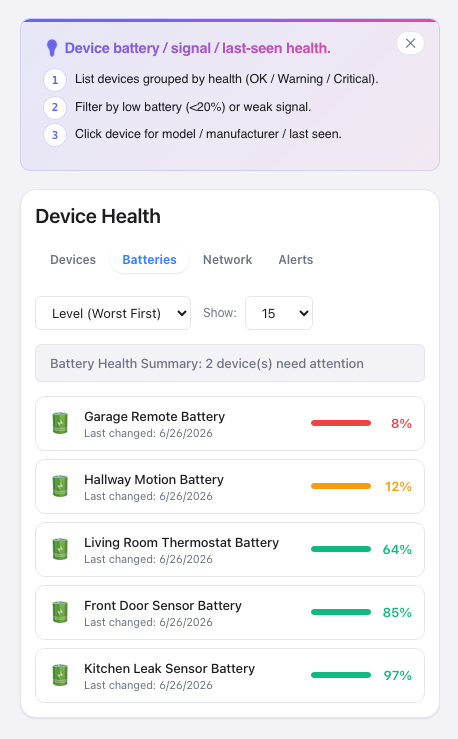

# 🏥 Device Health


Monitor device battery, signal and connectivity health.

[](https://www.home-assistant.io/) [](LICENSE) [](#changelog)

## Screenshots



> Part of the [HA Tools](https://github.com/MacSiem) ecosystem — split into individual HACS-installable plugins.

## Installation (HACS)

**Device Health is in the HACS default store** — no custom repository needed:

1. Open **HACS** in Home Assistant
2. Search for **Device Health**
3. Install and refresh your browser

[](https://my.home-assistant.io/redirect/hacs_repository/?owner=MacSiem&repository=ha-device-health&category=plugin)

## Usage

### Lovelace card

```yaml
type: custom:ha-device-health
```

### Optional sidebar panel (`configuration.yaml`)

```yaml
panel_custom:
  - name: ha-device-health
    sidebar_title: Device Health
    sidebar_icon: mdi:home-assistant
    url_path: ha-device-health
    js_url: /local/community/ha-device-health/ha-device-health.js
    embed_iframe: false
    config: {}
```

After restart, **Device Health** appears in the HA sidebar.

## Features

- Monitor device battery, signal and connectivity health.
- Bundled Bento Design System (light + dark mode, mobile-friendly)
- Self-contained — no shared HA Tools dependency
- Tool settings and dismissed-banner state are cached in browser `localStorage`
## Privacy

- No telemetry, no analytics, no tracking
- No external network calls, no CDN-hosted assets (system fonts only)
- No data leaves your device (no external network calls)
## Changelog

See [CHANGELOG.md](CHANGELOG.md).

## Support

If this tool makes your Home Assistant life easier, consider supporting development:

- [☕ Buy Me a Coffee](https://buymeacoffee.com/macsiem)
- [💳 PayPal](https://www.paypal.com/donate/?hosted_button_id=Y967H4PLRBN8W)

## License

MIT — see [LICENSE](LICENSE).
