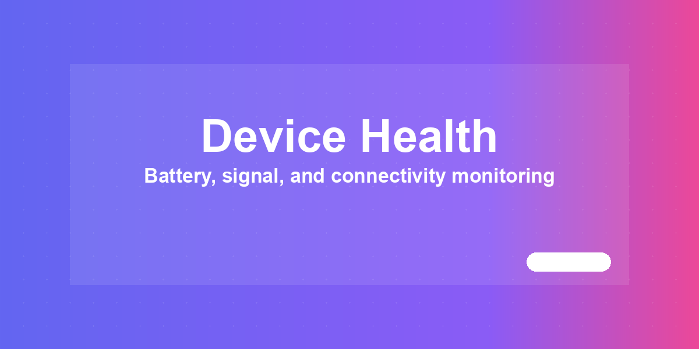
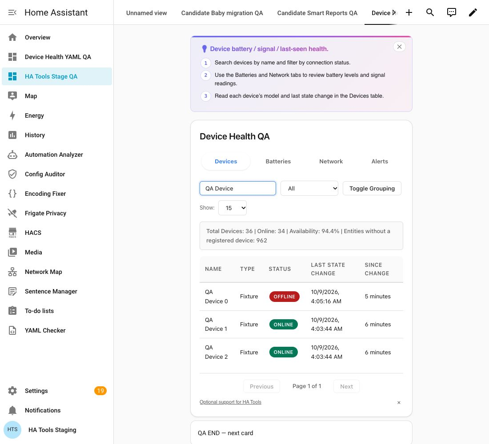
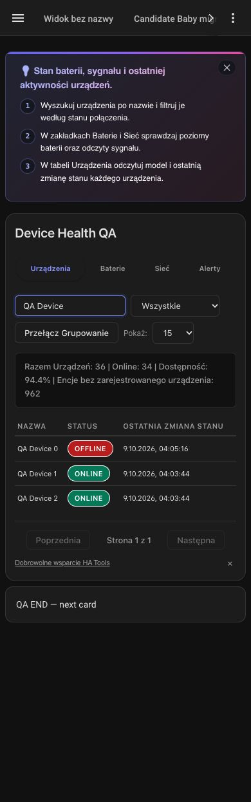
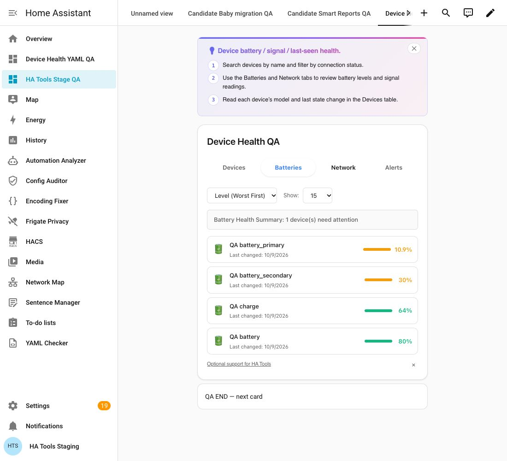
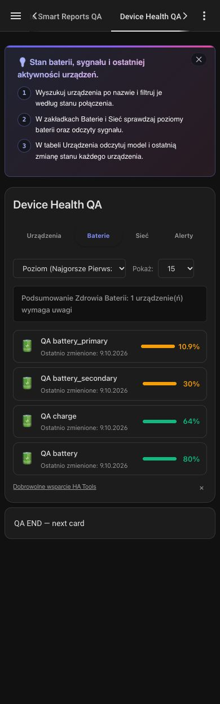
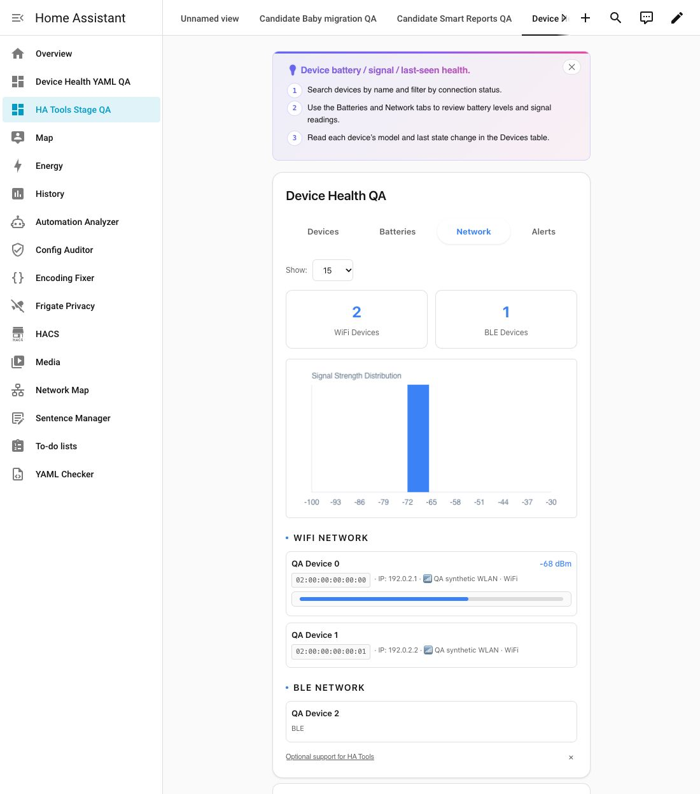
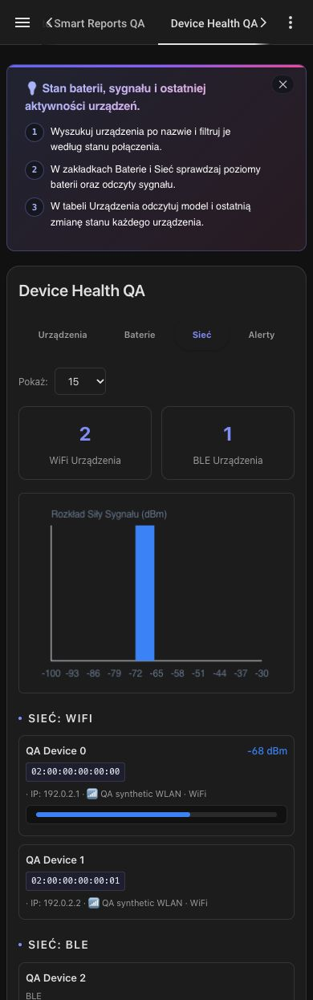
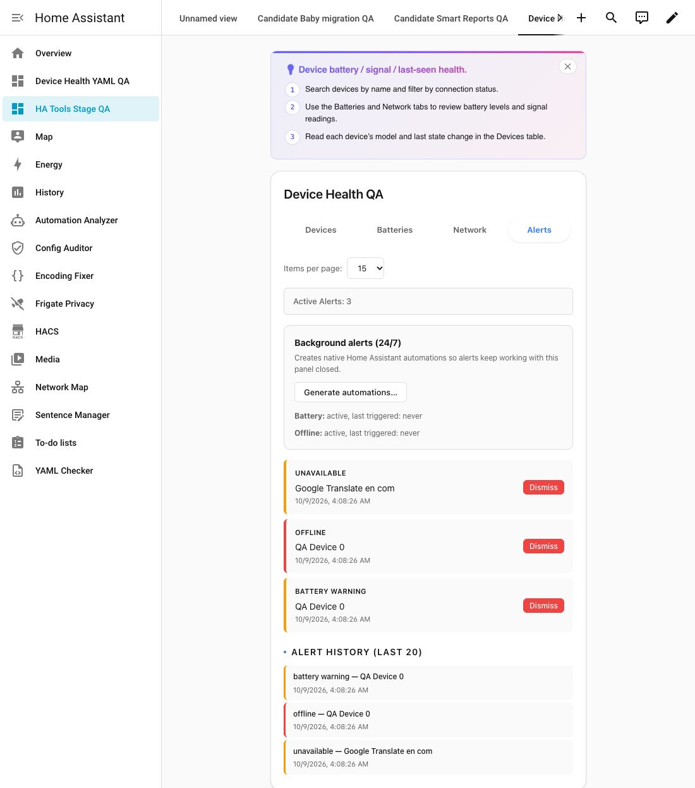
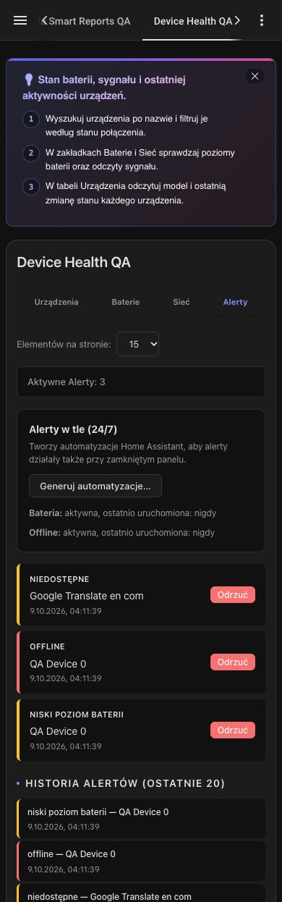

# HA Device Health



Monitor the health of your Home Assistant devices from one Lovelace card:
battery levels, availability and alerts. Zero configuration — add the card and it
joins Home Assistant's device and entity registries automatically.

[](https://github.com/MacSiem/ha-device-health/releases) [](LICENSE)

## How it works

**Short version: it works automatically.** The card reads device and entity
registries through your Home Assistant connection — no extra integration or YAML:

1. **Batteries.** An entity counts as a battery *level* only when it has
   `device_class: battery`, or a battery name together with a `%` unit, and a
   finite numeric state from 0 to 100. Decimal readings are preserved. Text and
   quantity helpers without battery-level metadata are excluded; humidity
   percentages are not battery readings.
2. **Availability.** Each registered device appears once. A device with no current
   entity state is marked unknown, not failed. A connectivity binary sensor's
   `off` or a router/connection tracker's `not_home` indicates disconnection;
   GPS absence and an ordinary switch's `off` do not. If another explicit
   connection is active, the device stays online. When all known connections
   drop, the offline delay starts at the latest valid disconnection time.
3. **Network evidence.** Bluetooth and Zigbee come from registry connections;
   Wi-Fi needs an explicit Wi-Fi connection type or SSID. A generic MAC or IP
   goes to Other, not Wi-Fi. Entity states without a registered device are
   counted separately and never counted as physical devices.
4. **Alerts.** Low-battery alerts and the needs-attention summary count each
   registered physical device once, using its lowest battery reading. Individual
   readings remain visible in Batteries; readings without a registered device
   remain independent. A continuous incident appears once in history. Dismissal
   lasts until recovery; a later incident can alert again. History and dismissal
   are held in card memory and reset when the card is recreated or the account
   changes. Counts that need registry identity show a dash while it is unavailable.

### What is automatic vs. manual

| Automatic | Manual (optional) |
|---|---|
| Discovering batteries and devices | Adjusting alert thresholds |
| Filtering out Battery+ helper entities | Dismissing/reviewing alerts |
| Availability monitoring | — |

## Screenshots

These are native Home Assistant screenshots with synthetic QA devices and
reserved test addresses. They show the English light theme and Polish dark
theme; the device table is filtered to the three QA devices.

| View | English, light | Polish, dark, narrow |
|---|---|---|
| Devices |  |  |
| Batteries |  |  |
| Network |  |  |
| Alerts |  |  |

Dark mode follows your Home Assistant theme. The signal chart uses available
RSSI readings. Invalid signal entities are skipped in favor of valid sibling
readings, then numeric `rssi` or `signal_strength` attributes. Missing readings
remain unknown and do not become a zero signal value.

## Installation

Requires Home Assistant 2024.1 or later.

1. Open HACS and search for **Device Health** under **Dashboard**.
2. Download the card and reload the browser when HACS prompts you.
3. Add `custom:ha-device-health` to your dashboard, including a Sections view.

If the repository is absent from your HACS search, add
`https://github.com/MacSiem/ha-device-health` in **Custom repositories** with
category **Dashboard**, then download it.

For a manual install, copy `ha-device-health.js` to `config/www/` and register
`/local/ha-device-health.js` as a JavaScript module resource. Storage dashboards
use Settings → Dashboards → Resources; YAML configurations can declare the same
module in `lovelace.resources`. Keep one resource for this card. When moving from
manual installation to HACS, remove only your old Device Health resource and use
the HACS resource, then reload the browser. Other dashboard resources stay in place.

If a reload still shows an older card, refresh the cached files for your HA site
and reload again. Keep sign-in data. Multiple URLs for the same Device Health
script can retain different cached versions; remove only your own obsolete
registration when consolidating them.

## Quick start

```yaml
type: custom:ha-device-health
```

That's it — no options are required.

The default heading and visual editor follow your Home Assistant language
(English or Polish). Set `title` to keep your own heading in either language;
leave it unset to use the translated default. Changing language preserves your
editor draft, thresholds and text selection.
Device status and network group captions use the same language; device names,
authored models and connection classifications are retained.

## Background notifications

The Alerts tab works while the card is open. An administrator can choose
**Generate automations…**, review the YAML and choose **Create** to keep native
Home Assistant notifications running with the card closed. Opening or cancelling
the preview does not save anything. Household users can view health information
and dismiss local card alerts; they cannot create or reload automations.

Create saves or updates `ha_device_health_battery_alert` and
`ha_device_health_offline_alert`, then reloads Home Assistant automations.
The standard UI automation configuration must be available, usually through
`automation: !include automations.yaml`. Both automation states and partial save
or reload errors are shown in the card; review an error before retrying.

The battery automation triggers when a reading crosses **below** the warning
threshold. The offline automation watches the generated entity list for
`unavailable` for the configured duration. These are per-entity notifications;
the card's physical device alerts also understand connectivity sensors and
router/connection trackers. Existing
low readings do not by themselves trigger a newly created numeric-state automation.

The generator uses one shared pair of automation IDs for the HA instance.
Creating from another card updates that pair with its thresholds and entity list.
Re-run it after adding devices. The battery list is limited to the first 150
readings, with a warning when it is truncated. Review the preview before saving.

## FAQ

**Do I have to configure anything?**
No. The card discovers batteries and devices from your existing entities.

**Why is a device marked unknown?**
The device is registered in HA but has no current entity state to measure.
The card will not invent a health result or Wi-Fi classification.

**Why doesn't my battery show up?**
It needs `device_class: battery`, or a battery name and a `%` unit, plus a finite
numeric 0–100 state. Text states ("low"/"ok") and quantity helpers without this
metadata are excluded.

**Does this send data anywhere?**
The card does not upload your states or registries. It uses your existing Home
Assistant connection and has no telemetry or CDN dependencies. Optional support
links open an external website only when you choose them.

## Changelog

See [CHANGELOG.md](CHANGELOG.md).

## Support

- [Buy Me a Coffee](https://buymeacoffee.com/macsiem)
- [PayPal](https://www.paypal.com/donate/?hosted_button_id=Y967H4PLRBN8W)

The optional in-card support link is shown only to administrators. Dismiss it in the card or set `show_support: false` in the card configuration.

## License

MIT, see [LICENSE](LICENSE).

## Privacy and data

The card reads Home Assistant states and device/entity registry metadata to show
health information. Alert history, acknowledgements and registry data remain in
card memory. The selected tab and instruction/support dismissal are remembered
in this browser for the plugin; those preferences are shared across its cards
and accounts on the same HA origin. Browser storage contains no device names,
addresses or alert history from this implementation.

Only an explicit administrator Create action saves the two native automations
and reloads them. Their configuration contains entity IDs and thresholds in your
Home Assistant instance; notifications can include entity names. Device and
entity labels can identify your home. Remove labels, identifiers and addresses
from screenshots or bug reports.

See [SECURITY.md](SECURITY.md) for safe vulnerability reporting and [NOTICE](NOTICE) for licensing notices.

## Independent project

Device Health is an independent community project and is not affiliated with or
endorsed by Home Assistant or HACS. Their names identify compatibility.
